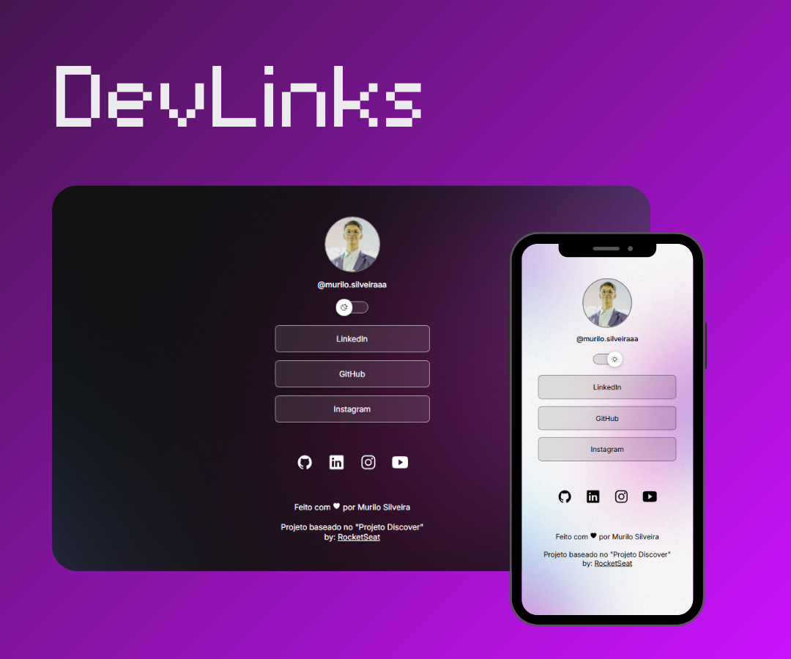

<h1 align="center"> Social Links </h1>

    Projeto desenvolvido a partir da trilha "DevLinks" ofertada pela Rocketseat. Utilizei do projeto como forma de estudo para relembrar
    conceitos importantes de CSS.

Preview do projeto finalizado :point_down:

  

## 🚀 Tecnologias

Esse projeto foi desenvolvido com as seguintes tecnologias:

- HTML e CSS
- JavaScript
- Git e Github
- Figma

## 💻 Projeto

O DevLinks é um agregador de links para usar como cartão de visitas online.

- [Acesse o projeto finalizado, online](https://murilorms22.github.io/Social-Links/)

## 🔖 Layout

Você pode visualizar o layout do projeto através [DESSE LINK](https://www.figma.com/community/file/1187422022288947321). É necessário ter conta no [Figma](https://figma.com) para acessá-lo.

---
